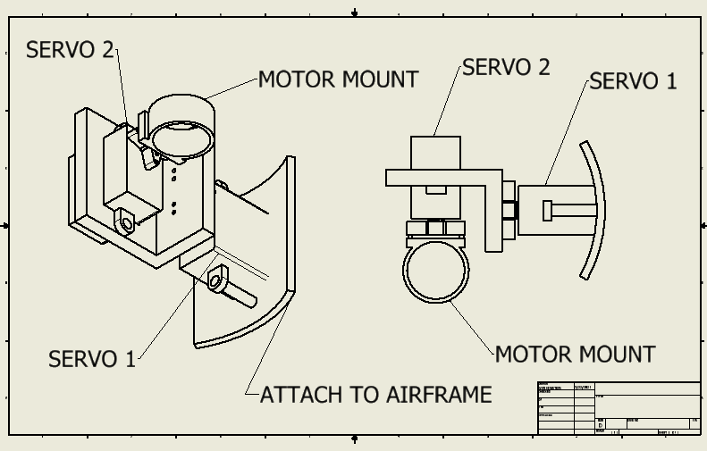

# Thrust Vector Control
 Creating a Thrust Vector Control gimbal PID system for solid propellant rockets.
 THe first prototype is being done on arduino.
 
 The goal is to come up with such a design
 

 Keep following for more information.
